# LIFX V4 Controller

## Introduction
The Autolog LIFX Controller is a plugin for the Indigo (version 7+) home automation system (http://indigodomo.com) that enables you to control LIFX devices from Indigo. It enables local LAN control of LIFX Devices without having to use an internet connection.

The Version 4 series of the plugin is implemented using Indigo Dimmer Devices to control the LIFX lamps and fully supporting the new built-in RGBW controls in Indigo 7. In addition to the standard controls, the plugin provides a comprehensive action (Set Color/White) to control all aspects of the LIFX device.

The plugin makes extensive use of the lifxlan library by Meghan Clark for which much thanks are due :) - see (https://github.com/mclarkk/lifxlan)

It is **strongly recommended** to read this documentation to familiarise yourself with the new way of working which is substantially different to the previous plugin (V1, V2 and V3) versions.

## Installation
### Prerequisites
This version of the LIFX Plugin controls LIFX lamps. The original LIFX lamps must be running the V2+ firmware. Newer lamp models will be OK for use by the plugin
The first and most essential installation pre-requisite is that you have some LIFX Lamps updated with the V2 firmware that you control via the iOS LIFX App. This Plugin needs some lamps to control!

The latest version of the plugin has been developed and tested on OS X El Capitan (10.11.6) and also tested on macOS Sierra (10.12.1).

### Pre-Installation
**IMPORTANT** - If you are using the existing version of the plugin, then you need to perform the following steps if you are using your existing LIFX lamps in Control Pages or Avtion Groups:

* **Edit existing LIFX lamp device settings**
    Edit the device settings for each of your existing LIFX bulbs, make sure that the field *Use Indigo Name* is unchecked and if not, uncheck it and Save. The next step will rename the Indigo devices and we don't want the actual LIFX lamps to have their names changed!

* **Rename existing Indigo LIFX devices**
    In order to avoid naming problems when the new plugin is installed, rename your existing Indigo LIFX devices by prefixing the name with say *LIFX3_* or somesuch name. This will leave any actions or control pages you have that use these LIFX lamps pointing at the renamed LIFX lamp.

* **Disable Existing plugin**
    Now disable the exsting plugin so that it can't intefere with the installation step (see next section).

If you aren't using your existing LIFX lamps in any Control Pages or Action Groups, you can just disable the existing LIFX plugin and then delete the LIFX devices prior to following the Installation steps in the next section.

### Installation
Download and install the plugin as normal for Indigo plugins.

### Plugin Configuration

When the plugin starts for the first time, the Configuration dialogue will be displayed. This dialogue is also available via the main Indigo menu *Plugins > LIFX > Configure...*.

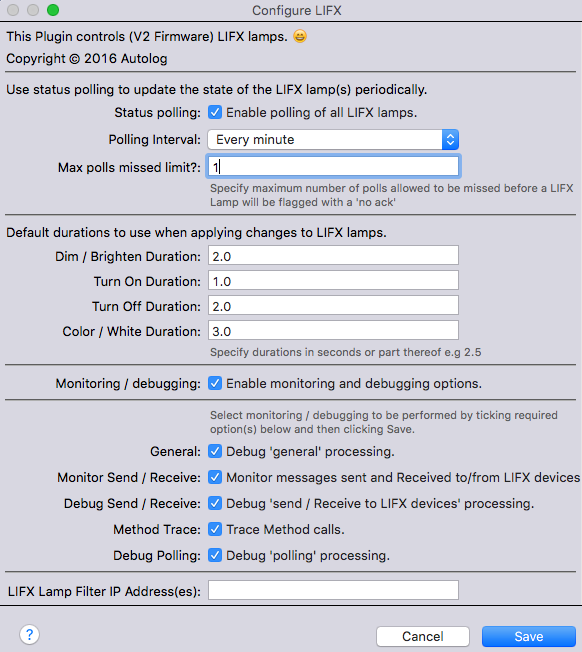

The plugin configuration dialogue has a number of options:

* **Status Polling
 & Polling Interval**
    Tick to enable polling of the LIFX lamps and select the Polling Interval from the pull down.
 Polling is used to detect external changes to the lamps from for example, the LIFX iOS App. Typical values might be *Every 30 Seconds* or *Every Minute*. 

* **Max polls missed limit**
    Specify maximum number of polls allowed to be missed before a LIFX Lamp will be flagged with a *'no ack'*. This is used to identify LIFX lamps that have disappeared from the local network e.g because it has been inadvertantly physically switched off.    

* **Default Durations
**
    Specifies separate default durations to be used if not otherwise specified (See the description of these duration settings in the Device Configuration section)

* **Monitoring / debugging**
    These options are to support monitoring and debugging. All logging is now done to Indigo 7 standards and to a separate file that can be accessed by clicking on the Show Events Logs Folder button in the Indigo Event Log window. The log file is *plugin.log* in the *com.autologplugin.indigoplugin.lifxcontroller* folder. This folder also contains date stamped logs from the previous five days.
    Logging is not normally required but can be useful for fault finding and debugging.

* **LIFX Lamp Filter IP Address
(es)**
    Used to filter the processing to one or more lamps (mainly for testing and debugging purposes). If a LIFX lamp's IP address is specified, any messages sent to or received from other lamps not in the list will be ignored. If you send a command (e.g. Turn On) to another lamp while the filter is active, then this will cause an error warning message to be displayed in the Indigo Event log.

### Device Configuration

All LIFX devices on the local network are discovered automatically by the plugin. Discovery can take a number of iterations before all LIFX devices are discovered.

On starting the plugin for the first time, the plugin will:

* Create 'LIFX' folders in the Devices Home Window and Variables Window which will contain the LIFX lamp devices and LIFX Preset variables used by the Plugin.

* Start discovery to detect LIFX lamps on the local network.

* It will create one device for each LIFX device that has been discovered

Once a LIFX Lamp device has been created, you can *Edit Device Settings…*

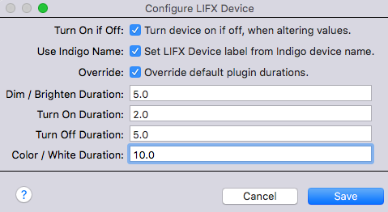

The configuration options are:

* **Use Indigo Name
**
    If this option is ticked then the Plugin will update the LIFX Lamp label (as shown in the LIFX iOS App) from the Indigo device Name. So typically to use this, you would first change the Indigo LIFX Lamp device name to your preferred choice and then Edit the device settings, tick this box and then Save. The LIFX Lamp’s lable (name) will then be updated with the Indigo device name and this name will now be shown in the iOS LIFX App. This option is useful if you haven’t Claimed the LIFX lamp and associated it with your online LIFX account as you can’t normally rename the lamp otherwise. With this option ticked, whenever you change the Indigo LIFX device name, the LIFX Lamp label will be changed. 

* **Override Default Plugin Durations
**
    If this option is ticked then it reveals a list of durations to set for this individual LIFX lamp that will override the default global plugin durations. You can set durations (measured in seconds) for:

    * **Dim / Brighten Duration
**
    How long the LIFX lamp will take to dim or brighten when you alter the brightness

    * **Turn On Duration
**
    How long the LIFX lamp will take to reach the target brightness when you turn it on

   * **Turn Off Duration
**
    How long the LIFX lamp will take to turn off

    * **Color / White Duration
**
    How long the LIFX lamp will take to reach the target Color/White settings when you use the plugin’s *Set Color / White* action

## Usage

### Start Up

When Indigo is restarted or the pluguin is reloaded, the plugin will run a Discovery of LIFX Lamps on the local network, creating newly discovered LIFX lamps as previously noted (in section above).

The UI Status of Indigo LIFX devices will initially be shown as 'No Ack' (No Acknowledgement). Once discovery has run, any devices discovered will show a *timer on* as the plugin waits to receive a status update from the LIFX lamp. Once a status update has been received, the standard *lamp on* or *lamp off* symbols will be shown as appropriate.

### Indigo UI Home Window Device Info

The discovered LIFX devices reside in the LIFX folder within the Indigo Home Window (that lists device). The relevant Device info listed in the Window is as follows:

* **State**

    Shows LIFX lamp state, normally an *on* or *off* icon and dimming state from 0 to 100. Can also be a red dot with 'No Ack' (No Acknowledgement) indicating communication has been lost with the LIFX bulb. Will also show *Timer On* between discovery and the first status update being received from the LIFX bulb.

* **Device Name**

    The name of the LIFX lamp received from the Physical LIFX Lamp device. This can be edited and the update applied to the LIFX lamp (see later).

* **Address**

    The MAC address of the physical LIFX lamp.

* **Notes**
    Pre-filled at Indigo LIFX lamp device creation with *LIFX Device*. Can be subsequently modified by user as the plugin will not apply any further updates to this field.

* **Folder**

    Discovered LIFX lamps are always created in the Indigo devices LIFX folder. Once created, the Indigo LIFX device can be moved to another folder with no ill affects.

* **Model**

    These are the LIFX device models known by the plugin:

    * Original 1000
    * Color 650
    * White 800 (Low Voltage)
    * White 800 (High Voltage)
    * White 900 BR30 (Low Voltage)
    * Color 1000 BR30
    * Color 1000
    * LIFX + A19
    * LIFX + BR30
    * LIFX Z

    **Note** that just because the plugin knows about a LIFX device, it doesn't neccesarily mean it is fully supported. As of version 4.0.1 of the plugin, it has only been tested with two models: *Original 1000* and *Color 1000*.

* **Protocol**

    LIFX :)

* **Firmware**

    Shows the LIFX lamp firmware for Host and Wi-fi. If there is only one value (e.g. 2.1) then this is the firmware version for both Host and w=Wi-fi. If there are two values separted by a vertical separator (e.g. 1.1|101.62) then the first value is the Hsot firmware version and the second is the Wi-fi firmware version.

### Built-In Indigo Controls

The plugin is implemented as an Indigo Dimmer Device, so the built-in Indigo controls can be be used to control the LIFX lamp(s):

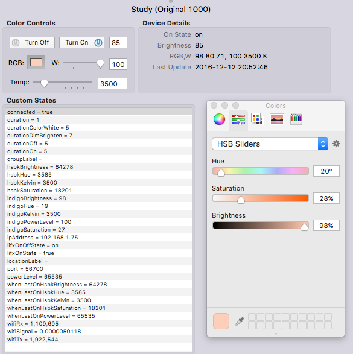

One of the many features of LIFX lamps is that commands (e.g. Turn On/Off, Dim/Brighten etc) can be requested to run for a specific duration such as 5 seconds (or shorter or longer) - so that the actions are done gradually. As the state of the lamp is changing dynamicaly over the duration period, the plugin will do a status update every second until the action is completed. 

So for example, if in the main UI you drag a White Level slider (see built-in controls in next section) from 100% to 0% and then release the mouse button and the *Dim / Brighten Duration
* has been pre-defined as 5 seconds, then the following will happen: The slider will be reset to 100% and then updated every second to ~80%, ~60%, ~40%, 20% as the LIFX lamp dims down, to finally 0%. The percentage values will vary as the timing won't be an exact multiple of one second taking into account other activity on the Mac and wi-fi speeds.

If while this dimming is taking place, you re-adjust the slider, then the process is reset and the new slider action takes over.

You will also see this occurring when you use the color controls (see built-in controls in next section).

The various built-in controls are described below:

* **Turn Off**
    Will turn off the LIFX lamp whilst remembering it's brightness level prior to turning off

* **Turn ON**
    Will turn on the LIFX lamp to the previously remembered brightness level

* **Brightness Level**
    The field next to the *Turn On* button contains the overall LIFX lamp *brightness level* which is a value worked out using the LIFX lamp's *brightness* and *saturation* values

* **RGB**
    The color swatch represents the current colour of the LIFX lamp. Clicking on the color swatch launches the Color Picker. You can choose different color modes e.g. RGB Sliders, HSB Sliders etc. The plugin handles the translation of the LIFX lamp color model (HSBK) to and from the Indigo color model (RGBW). Whilst there is for the most part a vey good correlation between the two models, there can at times be slight deviations. Adjusting the sliders will alter the color of the LIFX lamp and put the lamp into Color mode.

* **W**
    *W* represents White Level and adjusting this alters the brightness of the LIFX lamp and puts the LIFX Lamp into White mode. You can also directly enter the White level required in the adjacent field.

* **Temp**
    This is the *White Temperature (kelvin)* of the LIFX lamp. When altering the slider, the plugin will set the Kelvin level to the nearest value to the equivalent settings used in the iOS LIFX App, according to the following table:

    * 2500K Ultra Warm
    * 2750K Incandescent
    * 3000K Warm
    * 3200K Neutral Warm
    * 3500K Neutral
    * 4000K Cool
    * 4500K Cool Daylight
    * 5000K Soft Daylight
    * 5500K Daylight
    * 6000K Noon Daylight
    * 6500K Bright Daylight
    * 7000K Cloudy Daylight
    * 7500K Blue Daylight
    * 8000K Blue Overcast
    * 8500K Blue Water
    * 9000K Blue Ice
You can also directly enter the *White Temperature (Kelvin)* required in the adjacent field. This will also be adjusted according to the above table

### Device Actions
The LIFX lamps can be controlled using the built-in standard Indigo Device Actions > Light/Appliance Controls:

* All Off
* All Lights On
* All Lights Off
* Turn On
* Turn Off
* Toggle On/Off
* Set Brightness
* Brighten by %
* Dim by %
* Match Brightness
* Set RGBW Levels
**Note:** Pending a further required Indigo update (to be available post version 7.0.2) to resolve an issue with how the plugin can understand the user input, it is recommended to use the more comprehensive LIFX Actions > Set Color / White (see next section)

### LIFX Actions

The Plugin provides three additional actions under *'LIFX Actions’*:
* Discover LIFX Devices
* Set Color / White
* Apply Preset

#### Discover LIFX Devices
    Running this action will cause the plugin to try and discover LIFX devices on the local network. When new LIFX devices are found, the plugin will create a new Indigo LIFX device in the LIFX folder.

#### Set Color / White (Action)

When you select the *Set Color / White* LIFX action and select a LIFX lamp, the following configuration dialogue is displayed:

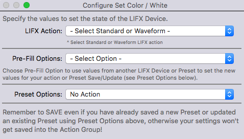

You can select *Standard* which enables you to alter the lamp settings or *Waveform* which enables you to flash the lamp with specific settings.

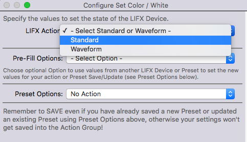

Selecting *Standard* then requests whether you want to set a Color or White setting.

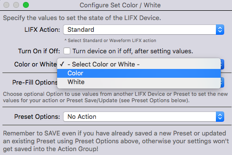

Selecting Color opens up the dialogue for a Standard Color setting.

##### Standard - Color

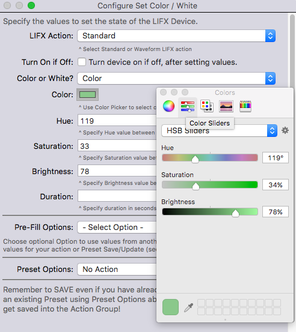

* **Turn On if Off**
    Tick this checkbox if you want the LIFX lamp to be turned on if it is currently off. If ticked and the LIFX lamp is off, when the action is executed, the settings will be applied and then the LIFX lamp is turned on. By leaving unticked it is possible to change the LIFX lamp settings while the LIFX lamp is off. 

* **Color or White**
    Selecting *Color* will display the Color settings as described here, selecting *White* will display the White settings as described in the next section.

* **Color (Swatch)**
    The Color Swatch gives an indication of the lamp color derived from the Hue, Saturation and Brightness fields below. If the values in the fields below are inconsistent or not present, the the Color Swatch will be shown as black. Clicking on the Color Swatch launches the Color Picker. You can choose different color modes e.g. RGB Sliders, HSB Sliders etc. The plugin handles the translation of the LIFX lamp color model (HSBK) to and from the Indigo color model (RGBW). As noted previously, whilst there is for the most part a vey good correlation between the two models, there can at times be slight deviations. Adjusting the Color Picker sliders wil alter the color and update the Hue, Saturation and Brightness fields.

* **Hue**
    A number from 0.0 to 360.0 representing the hue of the LIFX lamp color according to the standard 360 degree color wheel as used in the iOS LIFX App.

* **saturation**
    A number from 0.0 to 100.0 representing the saturation of the color of the LIFX lamp where 100 is fully saturated and 0 (zero) is no saturation i.e white color.

* **Brightness**
    A number from 0.0 to 100.0 representing the brightness of the LIFX lamp. Note this isn't the same as the Brightness Level shown by Indigo as that is derived from a combination of the LIFX lamp's brightness and saturation i.e. a brightness of 100 and saturation of 100 will give an Indigo Brightness Level of 50.

* **Duration**
    The number of seconds for the action to be executed over. Allows slow dimming and brightening. This overides plugin and device specified durations which will be used if this field is left blank.

Click the *Save* button to save your settings and then *O*K to save the Action.

##### Standard - White

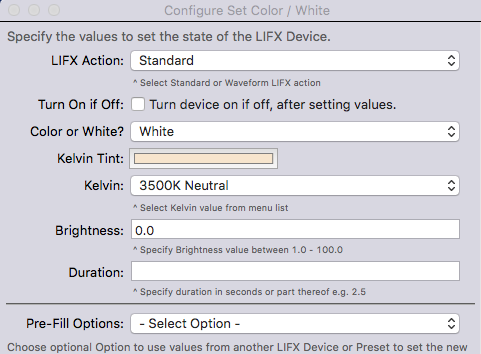

* **Turn On if Off**
    Tick this checkbox if you want the LIFX lamp to be turned on if it is currently off. If ticked and the LIFX lamp is off, when the action is executed, the settings will be applied and then the LIFX lamp is turned on. By leaving unticked it is possible to change the LIFX lamp settings while the LIFX lamp is off. 

* **Color or White**
    Selecting *White* will display the White settings as described here, selecting *Color* will display the Color settings as described in the previous section.

* **Kelvin**
    Select the Kelvin (White Temperature) value from the pull-down list:
    * 2500K Ultra Warm
    * 2750K Incandescent
    * 3000K Warm
    * 3200K Neutral Warm
    * 3500K Neutral
    * 4000K Cool
    * 4500K Cool Daylight
    * 5000K Soft Daylight
    * 5500K Daylight
    * 6000K Noon Daylight
    * 6500K Bright Daylight
    * 7000K Cloudy Daylight
    * 7500K Blue Daylight
    * 8000K Blue Overcast
    * 8500K Blue Water
    * 9000K Blue Ice

* **Brightness**
    A number from 0.0 to 100.0 representing the White Level brightness of the LIFX lamp. In this case there is a 1:1 relationship between the White Level brightness and the Brightness Level shown by Indigo.

* **Duration**
    The number of seconds for the action to be executed over. Allows slow dimming and brightening. This overides plugin and device specified durations which will be used if this field is left blank.

Click the *Save* button to save your settings and then *O*K to save the Action.

##### Waveform - Color

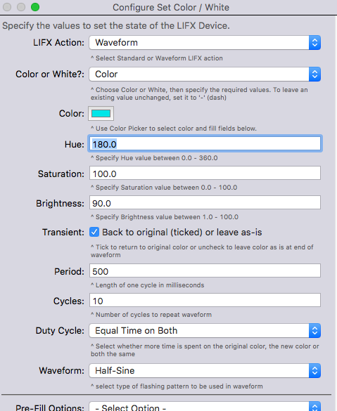

* **Color or White**
    Selecting *Color* will display the Color settings as described here, selecting *White* will display the White settings as described in the next section.

* **Color (Swatch)**
    The Color Swatch gives an indication of the lamp color derived from the Hue, Saturation and Brightness fields below. If the values in the fields below are inconsistent or not present, the the Color Swatch will be shown as black. Clicking on the Color Swatch launches the Color Picker. You can choose different color modes e.g. RGB Sliders, HSB Sliders etc. The plugin handles the translation of the LIFX lamp color model (HSBK) to and from the Indigo color model (RGBW). As noted previously, whilst there is for the most part a vey good correlation between the two models, there can at times be slight deviations. Adjusting the Color Picker sliders wil alter the color and update the Hue, Saturation and Brightness fields.

* **Hue**
    A number from 0.0 to 360.0 representing the hue of the LIFX lamp color according to the standard 360 degree color wheel as used in the iOS LIFX App.

* **saturation**
    A number from 0.0 to 100.0 representing the saturation of the color of the LIFX lamp where 100 is fully saturated and 0 (zero) is no saturation i.e white color.

* **Brightness**
    A number from 0.0 to 100.0 representing the brightness of the LIFX lamp. Note this isn't the same as the Brightness Level shown by Indigo as that is derived from a combination of the LIFX lamp's brightness and saturation i.e. a brightness of 100 and saturation of 100 will give an Indigo Brightness Level of 50.

* **Transient**
    Tick this checkbox if you want the LIFX lamp to be returned to its original settings when the waveform completes or not ticked to leave the lamp as is i.e. left at the settings at the end of the waveform.

* **Period
**
    The length of one waveform cycle in milliseconds

* **Cycles
**
    The number of cycles to repeat the waveform

* **Duty Cycle
**
    Select whether more time is spent on the original color, the new color or both the same:

    * Equal Time on Both
    * More Time on Original
    * More Time on New

* **Waveform
**
    Select type of flashing pattern to be used in waveform:

    * Saw
    * Sine
    * half-sine
    * Triangle
    * Pulse

    Probably best to experiment as to the setting that looks best for your requirement.

Click the *Save* button to save your settings and then *O*K to save the Action.

##### Waveform - White

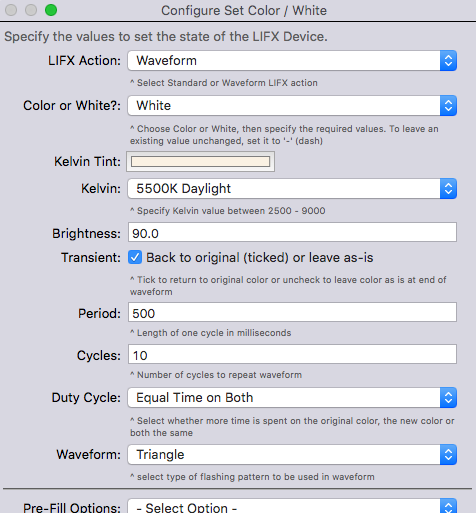

* **Color or White**
    Selecting *White* will display the White settings as described here, selecting *Color* will display the Color settings as described in the previous section.

* **Kelvin**
    Select the Kelvin (White Temperature) value from the pull-down list:
    * 2500K Ultra Warm
    * 2750K Incandescent
    * 3000K Warm
    * 3200K Neutral Warm
    * 3500K Neutral
    * 4000K Cool
    * 4500K Cool Daylight
    * 5000K Soft Daylight
    * 5500K Daylight
    * 6000K Noon Daylight
    * 6500K Bright Daylight
    * 7000K Cloudy Daylight
    * 7500K Blue Daylight
    * 8000K Blue Overcast
    * 8500K Blue Water
    * 9000K Blue Ice

* **Brightness**
    A number from 0.0 to 100.0 representing the White Level brightness of the LIFX lamp. In this case there is a 1:1 relationship between the White Level brightness and the Brightness Level shown by Indigo.

* **Transient**
    Tick this checkbox if you want the LIFX lamp to be returned to its original settings when the waveform completes or not ticked to leave the lamp as is i.e. left at the settings at the end of the waveform.

* **Period
**
    The length of one waveform cycle in milliseconds

* **Cycles
**
    The number of cycles to repeat the waveform

* **Duty Cycle
**
    Select whether more time is spent on the original color, the new color or both the same:

    * Equal Time on Both
    * More Time on Original
    * More Time on New

* **Waveform
**
    Select type of flashing pattern to be used in waveform:

    * Saw
    * Sine
    * half-sine
    * Triangle
    * Pulse
    
    Probably best to experiment as to the setting that looks best for your requirement.

Click the *Save* button to save your settings and then *O*K to save the Action.

##### Set Color / White (Preset)

Presets are stored as variables in the *LIFX* folder (Variables window).
 The basic idea of a Preset is to define it using the values from the main dialogue values panel which you may have derived from a LIFX Lamp, another Preset or entered manually. 

To save a preset, select *Save New Preset*. Enter the Preset name which has to consist of alphanumeric and underscore characters only. Click the *Save New Preset* button (not the main *SAVE* button - if you do click *SAVE* by mistake a message will be displayed with a warning):

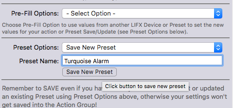

Once the preset has been saved a message *SUCCESS: Preset successfully saved* will be displayed.

A similar process is followed to update an existing Preset by selecting Update existing Preset, selecting the Preset to update and clicking the *Update Existing Preset* button:


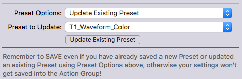

Once the Preset has been updated, the message *SUCCESS: Preset successfully updated* will be displayed.

Note that at this point you have only saved the Preset, you will most likely still want to save your settings. So remember to SAVE even if you have already saved a new Preset or updated an existing Preset using Preset Options above, otherwise your settings won't get saved into the Action Group! 

To avoid the situation where you may not have completed the saving or updating of a Preset, the Preset Options must be set to *No Action* before you can Save. This is a safety check in case you meant to save/update a Preset and forgot to do so ;-)

##### Set Color / White (Pre-fill)

###### Pre-Fill Selection

Pre-Filling enables you to select existing values from another LIFX lamp or an existing Preset.

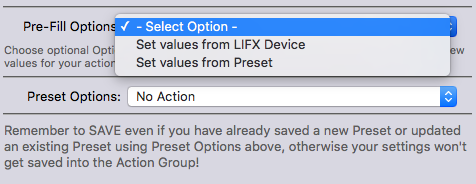

Choose whether to pre-fill from anoter LIFX lamp or a Preset.

###### Pre-filling Waveform from LIFX lamp

Select the LIFX lamp you wish to pre-fill the values from and in this Waveform example, the following dialogue is displayed:

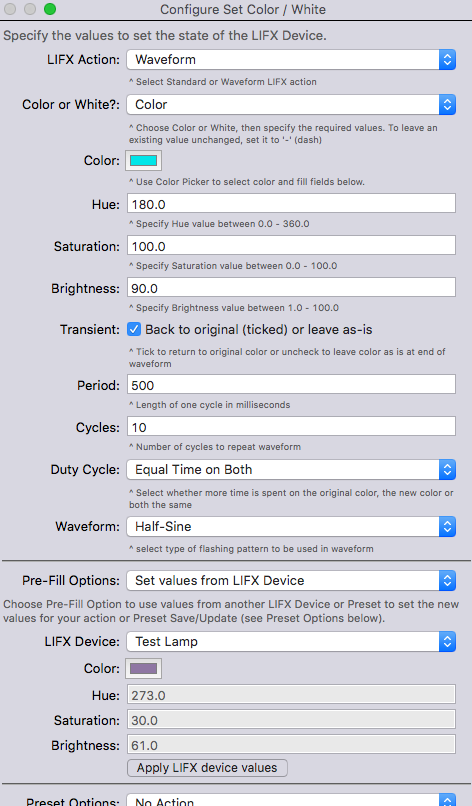

In this case ony the Hue, Saturation and Brightness settings will be applied. If the LIFX lamp being copied was in White mode then only the Kelvin and Brightness would be copied. Click Apply LIFX device values to copy the fields into the values above.

###### Pre-filling Waveform from existing Waveform Preset

Select the Preset you wish to pre-fill the values from and in this Waveform example, the following dialogue is displayed:

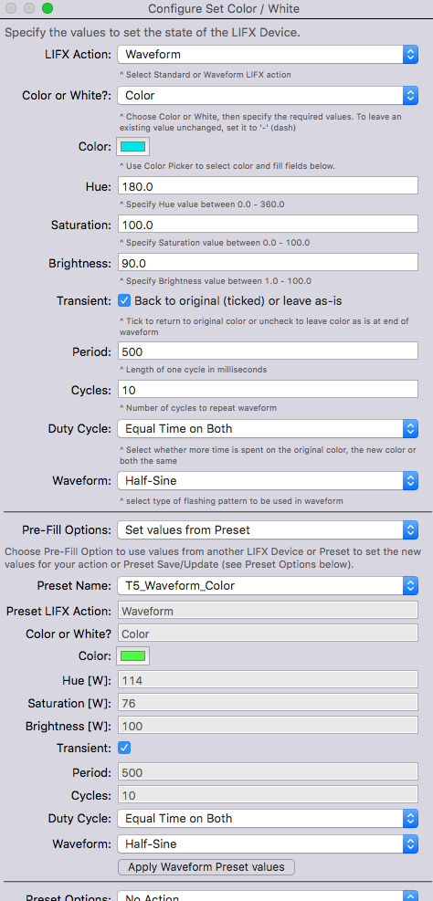

In this case, the Preset being selected is an existing Waveform Preset. Clicking Apply Waveform Preset values will update the main dialogue values.

Note if the Preset selected was a Standard Preset (rather than Waveform), the main dialogue above would be changed from Waveform input fileds to Standard input fields.

#### Save


Finally, the whole object of the exercise is to save the Action Group. So click Save to do this. Remember to Save even if you have already saved a new Preset or updated an existing Preset using the Preset Options, otherwise your settings won't get saved into the Action Group.

#### Apply Preset (Action)

This action executes a predefined Preset.

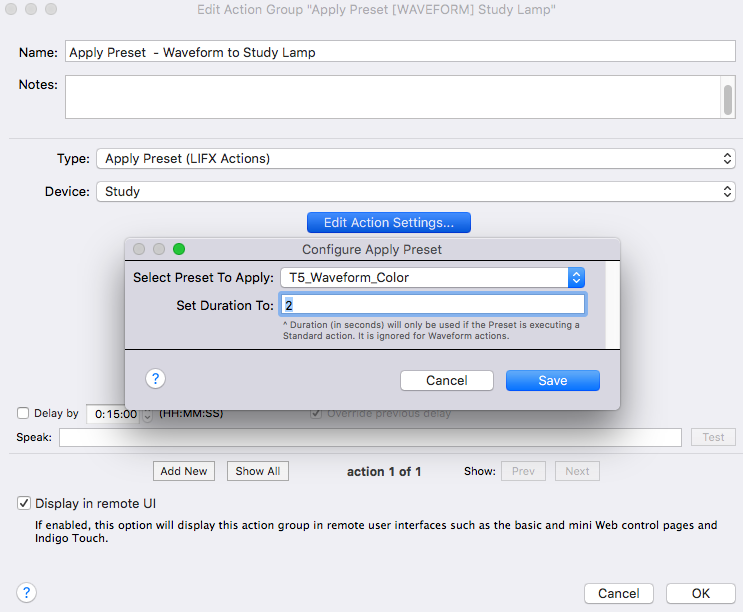

Select the required Preset and optionally, specify a required duration (in seconds). Note that Duration will only be used if the Preset is executing a Standard action, it is ignored for Waveform actions. If not specified then the default duration will be used.

Click the *Save* button to save the settings and then *O*K to save the Action.

### States
The plugin provides the following states:

*To Be Advised*

### Scripting

The LIFX plugin's ID is 'com.autologplugin.indigoplugin.lifxcontroller'.

*Scripting example to follow*
